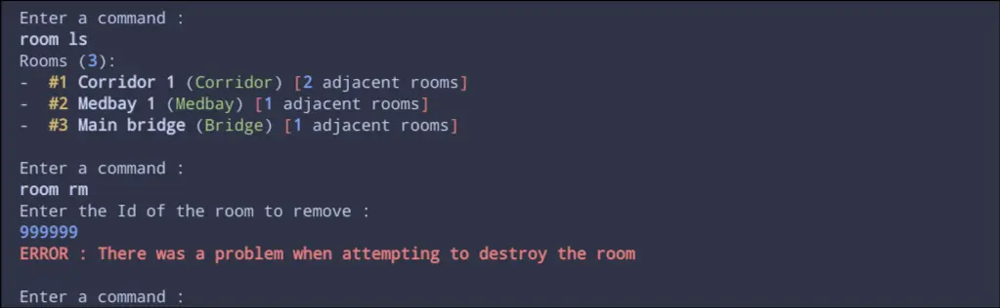
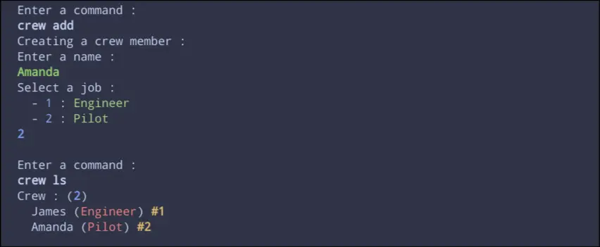
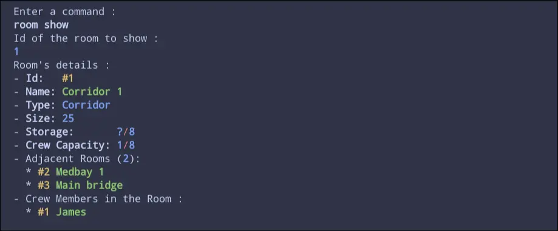
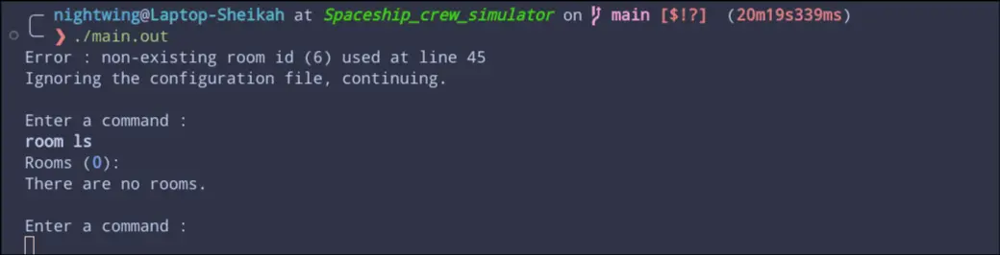

# Spaceship crew simulator

## How to run

Linux/WSL
```sh
sh ./compile.sh # sh is optional, ./compile.sh works fine
./main.out
```
Then (by default) Ctrl+C to stop the program.

## What is it ?

It's a command line based program written in C, which aims to simulate a crew inside a spaceship.  

There are rooms, which each have an **id**, a **name**, a **type** (Corridor, Medbay...), a **size**, a **maximum crew capacity**, a separate **maximum storage capacity**, and a list of **adjacent rooms**.  
There are crew members, who have an **id**, a **name**, a **job**, a **current room** (where they are), and a **destination room** (where they are headed).  

Everything you can do with the crew and the rooms is listed below (in short : add, edit, destroy, move).  

There's also a config file to load the game with preconfigured rooms and crew members, more on that later.

## Uh, why ?

The main reason I built it was to learn C, and after a few months on and off, I now consider myself to be *"reasonably decent"* at programming in this language, so, goals achieved ahah !  
 
I do not plan on extending it further, but it's worth noting that I will be remaking **and** extending the project in C++, in a public repo that you can probably find, unless you are reading this very shortly after what should be my last commit to this repo.  

## Features : 

### Commands

When the program is running, you will be prompted to enter a command (unless you're inside of a command, where you are prompted to enter specific values). These commands are structured this way : `crew edit`, or `room ls`, and do **not** take other arguments on the same line.  
  
Both their input and output are styled (though limited by the terminal: normal/bold/italic and 16 colors) similarly to a code editor, to make reading as confortable as possible (i.e. **green** string input, **blue** integer input, **bold red** error messages... See Images below)  
  
Here is a list of every command available with a short desciption of what they do (for familiarity, they are similar to Unix shell commands) :

- **crew** :
  - **ls** : list crew
  - **add** : add a crew member
  - **edit** : edit a crew member
  - **rm** : remove a crew member
  - **goto** : change the destination room of a crew member
  - **mv** : move a crew member one room toward its destination
  - **show** : diaplay details of a crew member

- **room** :
  - **ls** : list all rooms
  - **add** : add a room
  - **edit** : edit a room 
  - **rm** : remove a room
  - **link** : make two rooms adjacents to one another
  - **unlink** : make two rooms not adjacent anymore
  - **show** : diaplay details of a room

---

### Configuration File

To make it easier (for me, mostly,) to create **rooms** and **crew members**, a configuration file can be created and filled to generate these, without having to re-create or hardcode them.  

I won't get into the syntax too deeply here, as I already explain a lot in the example config file (*config.yml*) present in the repo, but I'd like to explain a few thing that might seem curious at first glance :  

1. The config file is hardcoded to be named `config.yml`, and has to be in the directory of the executable.  

2. The language itself is *mostly* a subset of yaml, except for 2 things : Strings without quotes to separate them, for ease of parsing while still alowing any characters (no such things as `\"` necessary), everything that's on the line of an attribute of type String (yes, types are not infered from the value, but depend on the property they are assigned to (i.e. name: **String**, id: **Int**)), which is why comments are not supported on the same line as strings. Second thing is arrays can only be written on the same line, starting with a `[`, and ending with a `]`.

3. Integer values can be negative, although all of them are interpreted as a strictly positive integer. Shouldn't I make the parser throw an error when a negative value should be positive ? Maybe, but where's the fun in that ? I find it much better to have an easy shortcut to an ~18 billion m² room.

4. Even though a room is allowed to not have any adjacent room, the **adjacentRooms** attribute is still required. This is because the order of the attributes of a room/crew member does not matter, so the only way for me to be certain that a room has been parsed, is to check if every one of its attribute has been parsed, meaning I can't have an attribute that may or may not be here.

## Technical documentation (sort of)

The project uses an MVC (Model-View-Controller) architecture, with MVC components (each in its own `.c`/`.h` file) for **rooms** and **crew members**.  
  
- Models contain the methods to add/edit/remove custom objects like rooms, crew members and arrays of these types, as well as helper functions.  
  
- Views contain methods to display information and gather user input.  
  
- Controllers handle the commands entered by the user, and call the appropriate methods from the View and the Model.  

The dependency tree looks like the following for the crew :
```
Main
└─ Global_Variables
└─ Config_Parser
└─ Super_Controller
   └─ Crew_Controller
      └─ Global_Variables
      └─ Crew_Model
      └─ Crew_View
```
Global Variables containing the variables like the array of crew members with its size, and the array of rooms, also with its size.  

The `Model/type_definitions.h` is also included in almost every file. It notably provides the **room** and **crewMember** struct, as well as the enums for the different **jobs** / **roomTypes**, and a few useful Macros such as the maximum size of a room's name.  

## AI Disclaimer

No lines of code/doc were generated by AI, but I have used it (though rarely) for explaining memory related bugs I encountered (such as buffer overflows, dereferencing of null pointers, and access to unallocated memory), which I simply could not understand given my initial experience.  

## Images


"room ls" command followed by "room rm" on a room that doesn't exist


"crew add" command followed by "crew ls" 


"room show" command on an existing room



An error message from the config parser, followed by the "room show" command
